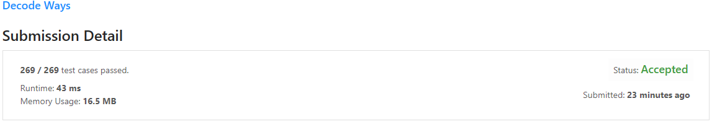
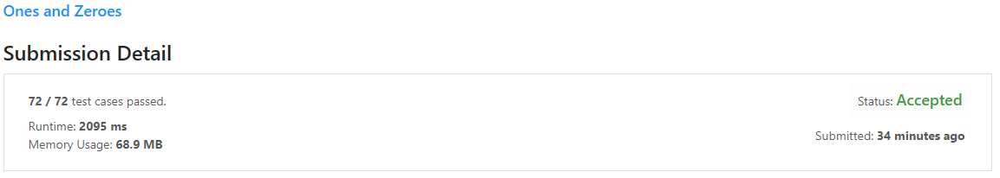
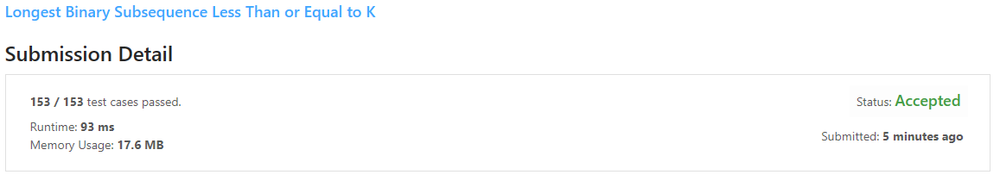
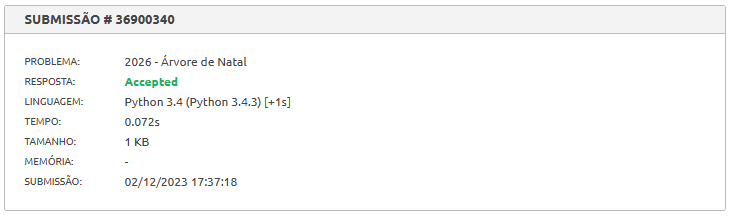

# Programação Dinâmica Exercícios Resolvidos

**Conteúdo da Disciplina**: Programação Dinâmica<br>

## Alunos
| Matrícula  | Aluno                                                        |
| ---------- | ------------------------------------------------------------ |
| 19/0089601 | [João Lucas Pinto Vasconcelos](https://github.com/HacKairos) |

## Sobre 
Meu projeto se trata sobre a resolução de alguns exercícios no juiz online, nessa entrega fiz 4 exercícios, sendo 3 do [LeetCode](https://leetcode.com/) e 1 do [Beecrowd](https://www.beecrowd.com.br/judge/pt), tentando chegar em uma resolução utilizando os algoritmos apresentados no decorrer das aulas de Programação Dinâmica, os exercícios escolhidos e suas respectivas dificuldades foram:

[Decode Ways](https://leetcode.com/problems/decode-ways/description/): Mediano

[Ones and Zeroes](https://leetcode.com/problems/ones-and-zeroes/description/): Mediano

[Longest Binary Subsequence Less Than or Equal to K](https://leetcode.com/problems/longest-binary-subsequence-less-than-or-equal-to-k/description/): Mediano

[Árvore de Natal](https://www.beecrowd.com.br/judge/pt/problems/view/2026): 5 em uma escala de 10

## Vídeo
Para o vídeo eu disponibilizei no repositório e disponibilizei o vídeo no Youtube.

[Repositório](video/video.mp4)

[Youtube](https://youtu.be/)

## Resultados

### [Decode Ways](https://leetcode.com/problems/decode-ways/description/)


### [Ones and Zeroes](https://leetcode.com/problems/ones-and-zeroes/description/)


### [Longest Binary Subsequence Less Than or Equal to K](https://leetcode.com/problems/longest-binary-subsequence-less-than-or-equal-to-k/description/)


### [Árvore de Natal](https://www.beecrowd.com.br/judge/pt/problems/view/2026)



## Instalação 
**Linguagem**: Python<br>
Apenas será necessário criar um arquivo de entrada de acordo com os exemplos de cada exercício e utilizar o seguinte comando:

```bash
python3 arquivo.py < entrada.txt
```

## Solução

### [Decode Ways](src/91.py)
```python
class Solution:
    def numDecodings(self, s: str) -> int:
        tamanhoStr = len(s)  # Comprimento da string codificada
        dp = [-1] * tamanhoStr  # Inicializa a matriz de programação dinâmica
        return self.decodificar(s, 0, dp)  # Inicia a função de decodificação

    def decodificar(self, s, indiceAtual, dp):
        tamanhoStr = len(s)  # Obtém o comprimento da string
        if indiceAtual == tamanhoStr:  # Se chegamos ao final da string, retorna 1
            return 1
        if s[indiceAtual] == '0':  # Se o caractere atual é '0', retorna 0
            return 0
        if dp[indiceAtual] != -1:  # Se já calculamos este subproblema, retorna o resultado armazenado
            return dp[indiceAtual]
        caminhos = self.decodificar(s, indiceAtual + 1, dp)  # Chamada recursiva para o próximo caractere
        # Se os próximos dois caracteres formam um número menor que 27, faz uma chamada recursiva para o caractere após o próximo
        if indiceAtual < tamanhoStr - 1 and (int(s[indiceAtual]) * 10 + int(s[indiceAtual + 1])) < 27:
            caminhos += self.decodificar(s, indiceAtual + 2, dp)
        dp[indiceAtual] = caminhos  # Armazena o resultado na matriz de programação dinâmica
        return caminhos  # Retorna o número de caminhos
```

#### Explicação

Este código é uma implementação de programação dinâmica para o problema de decodificação de mensagens. A mensagem é uma sequência numérica onde cada número (ou par de números) pode ser decodificado em uma letra - por exemplo, '1' pode ser decodificado como 'A', '2' como 'B', ..., '26' como 'Z'.

A classe Solution tem dois métodos: numDecodings e ajudaDecodificacao.

numDecodings inicializa uma lista memo para armazenar resultados de subproblemas e chama ajudaDecodificacao.

ajudaDecodificacao é uma função recursiva que calcula o número de maneiras de decodificar a string a partir de um índice. Se o índice atual é o final da string, retorna 1. Se o caractere atual é '0', retorna 0. Se o resultado para o índice atual já foi calculado, ele é recuperado de memo.

Caso contrário, o método calcula o número de decodificações considerando o caractere atual sozinho e, se possível, considerando o caractere atual e o próximo juntos. O resultado é armazenado em memo e retornado.

Essa abordagem é um exemplo de programação dinâmica, pois armazena os resultados de subproblemas para evitar cálculos repetidos.


### [Ones and Zeroes](src/474.py)
```python
class Solution:
    def findMaxForm(self, strs: list[str], m: int, n: int) -> int:
        self.contagemUns = [s.count('1') for s in strs]  # Conta o número de '1's em cada string
        self.dp = [[[-1 for _ in range(n+1)] for _ in range(m+1)] for _ in range(len(strs)+1)]  # Inicializa a matriz de programação dinâmica
        return self.mochila(strs, m, n, 0)  # Inicia a função mochila

    def mochila(self, strs, m, n, i):
        if i >= len(strs):  # Se chegamos ao final da lista de strings, retornamos 0
            return 0
        if self.dp[i][m][n] != -1:  # Se já calculamos este subproblema, retornamos o resultado armazenado
            return self.dp[i][m][n]
        uns = self.contagemUns[i]  # Número de '1's na string atual
        zeros = len(strs[i]) - uns  # Número de '0's na string atual
        # Se podemos formar a string atual com os '0's e '1's disponíveis, fazemos uma escolha
        if m - zeros >= 0 and n - uns >= 0:
            self.dp[i][m][n] = max(1 + self.mochila(strs, m - zeros, n - uns, i+1), self.mochila(strs, m, n, i+1))
        else:  # Se não podemos formar a string atual, passamos para a próxima string
            self.dp[i][m][n] = self.mochila(strs, m, n, i+1)
        return self.dp[i][m][n]  # Retornamos o número máximo de strings que podemos formar    
```

#### Explicação

O objetivo é determinar o subconjunto de itens que maximiza o valor total sem exceder a capacidade de peso da mochila. Neste caso, a “mochila” é a capacidade de '0’s e '1’s que você pode usar, os “itens” são as strings na lista strs, e o “peso” de cada string é o número de '0’s e '1’s que contém.

Para cada string, ela faz uma escolha: ou inclui a string atual no conjunto de strings formadas (se a string pode ser formada com o número de '0’s e '1’s disponíveis) e faz uma chamada recursiva para a próxima string com o número de '0’s e '1’s atualizados, ou não inclui a string atual e faz uma chamada recursiva para a próxima string sem atualizar o número de '0’s e '1’s.

Ele recebe uma lista de strings, strs, e dois inteiros, m e n, que representam o número total de '0’s e '1’s, respectivamente, que podem ser usados para formar strings.

Dentro do método findMaxForm, primeiro é criada uma lista contagemUns que contém a contagem de '1’s em cada string na lista strs. Em seguida, é inicializada uma matriz tridimensional dp que serve como a tabela de memoização para a programação dinâmica. Cada elemento da matriz é inicializado com -1, indicando que o subproblema correspondente ainda não foi resolvido.

O método mochila é uma função recursiva que resolve o problema usando programação dinâmica e memoização. Se o índice é maior ou igual ao comprimento da lista de strings, a função retorna 0, indicando que não há mais strings para formar. Se o subproblema atual já foi resolvido (ou seja, se o valor correspondente na matriz dp não é -1), a função retorna o resultado armazenado. Se a string atual pode ser formada com o número de '0’s e '1’s disponíveis, a função faz uma escolha: ou inclui a string atual no conjunto de strings formadas e faz uma chamada recursiva para a próxima string com o número de '0’s e '1’s atualizados, ou não inclui a string atual e faz uma chamada recursiva para a próxima string sem atualizar o número de '0’s e '1’s. Se a string atual não pode ser formada com o número de '0's e '1's disponíveis, a função simplesmente passa para a próxima string sem incluir a string atual.


### [Longest Binary Subsequence Less Than or Equal to K](src/2311.py)
```python
import math

class Solution:
    def longestSubsequence(self, s: str, k: int) -> int:
        def dp(s, index, k, val, memo, power):
            # Caso base: se o índice for -1, retorne 0
            if index == -1:
                return 0
            # Se já calculamos este subproblema antes, retorne o resultado armazenado
            if (index, val) in memo:
                return memo[(index, val)]
            # Inicialize a resposta como -infinito
            ans = -math.inf
            # Calcule o novo valor
            new_val = 2**power * int(s[index])
            # Escolha incluir este valor
            if val + new_val <= k:
                # Calcule a resposta local se incluirmos este valor
                loc_ans = 1 + dp(s, index - 1, k, val + new_val, memo, power + 1)
                # Atualize a resposta se a resposta local for maior
                ans = max(loc_ans, ans)
            # Pule este valor
            else:
                # Calcule a resposta local se pulamos este valor
                loc_ans = dp(s, index - 1, k, val, memo, power)
                # Atualize a resposta se a resposta local for maior
                ans = max(loc_ans, ans)
            # Armazene a resposta para este subproblema no memo
            memo[(index, val)] = ans
            # Retorne a resposta
            return ans
        # Chame a função dp para o problema completo
        return dp(s, len(s) - 1, k, 0, {}, 0)
```

#### Explicação
Este código é uma implementação de programação dinâmica para resolver o problema de encontrar a subsequência mais longa de uma string binária que compõe um número menor ou igual a um valor k dado.

A função dp é a função de programação dinâmica que recebe seis argumentos: a string s, o índice atual indice, o valor limite k, o valor acumulado valor, um dicionário para memoização memoria e a potência atual do número binário potencia.

A programação dinâmica é usada aqui para evitar cálculos repetidos. Para cada índice na string s e para cada valor acumulado, calculamos a resposta apenas uma vez e a armazenamos no dicionário memoria. Se encontrarmos o mesmo índice e valor acumulado novamente, simplesmente retornamos a resposta armazenada em vez de recalculá-la.

Para cada índice, temos duas opções: incluir o valor atual na subsequência ou pular o valor atual. Se incluirmos o valor atual, adicionamos o novo valor ao valor acumulado e incrementamos a potência. Se pulamos o valor atual, mantemos o valor acumulado e a potência inalterados. Para cada opção, calculamos a resposta e atualizamos a resposta se a nova resposta for maior.

Finalmente, retornamos a resposta para o problema completo chamando a função dp com o último índice da string s, o valor limite k, um valor acumulado de 0, um dicionário de memoização vazio e uma potência de 0.

### [Árvore de Natal](src/arvore.py)
```python
def knapsack(W, wt, val, n):
    K = [[0 for w in range(W + 1)]
            for i in range(n + 1)]
                
    for i in range(n + 1):
        for w in range(W + 1):
            if i == 0 or w == 0:
                K[i][w] = 0
            elif wt[i-1] <= w:
                K[i][w] = max(val[i-1] + K[i-1][w-wt[i-1]],  K[i-1][w])
            else:
                K[i][w] = K[i-1][w]
    
    return K[n][W]

G = int(input())  # Quantidade de testes

for i in range(G):
    print ("Galho %d:" % (i+1))
    P = int(input())  # Quantidade de itens
    W = int(input())  # Capacidade da mochila
    E = []  # Inicializando a lista E
    PC = []  # Inicializando a lista PC
    for _ in range(P):
        e, pc = map(int, input().split())  # Lendo o peso e o valor de cada item
        E.append(e)
        PC.append(pc)

        # Chamar a função knapsack
    result = knapsack(W, PC, E, P)
    print("Numero total de enfeites: %d\n" % result)
```

#### Explicação

Este código é uma implementação do problema da mochila (knapsack problem) usando programação dinâmica. O problema da mochila é um problema de otimização combinatorial clássico que tenta determinar a combinação mais valiosa de itens a serem colocados em uma mochila, dado um limite de peso.

A função knapsack recebe quatro argumentos: W que é a capacidade máxima da mochila, wt que é uma lista dos pesos dos itens, val que é uma lista dos valores dos itens e n que é o número total de itens. Ela retorna o valor máximo que pode ser colocado na mochila sem exceder a capacidade.

A matriz K é usada para armazenar os valores máximos para subproblemas de diferentes tamanhos e capacidades. Cada elemento K[i][w] representa o valor máximo que pode ser obtido com uma mochila de capacidade w e itens de 1 a i.

O código então lê o número de testes G e para cada teste, lê a quantidade de itens P, a capacidade da mochila W e os pesos e valores de cada item. Ele chama a função knapsack para cada teste e imprime o número total de enfeites que podem ser colocados na mochila.